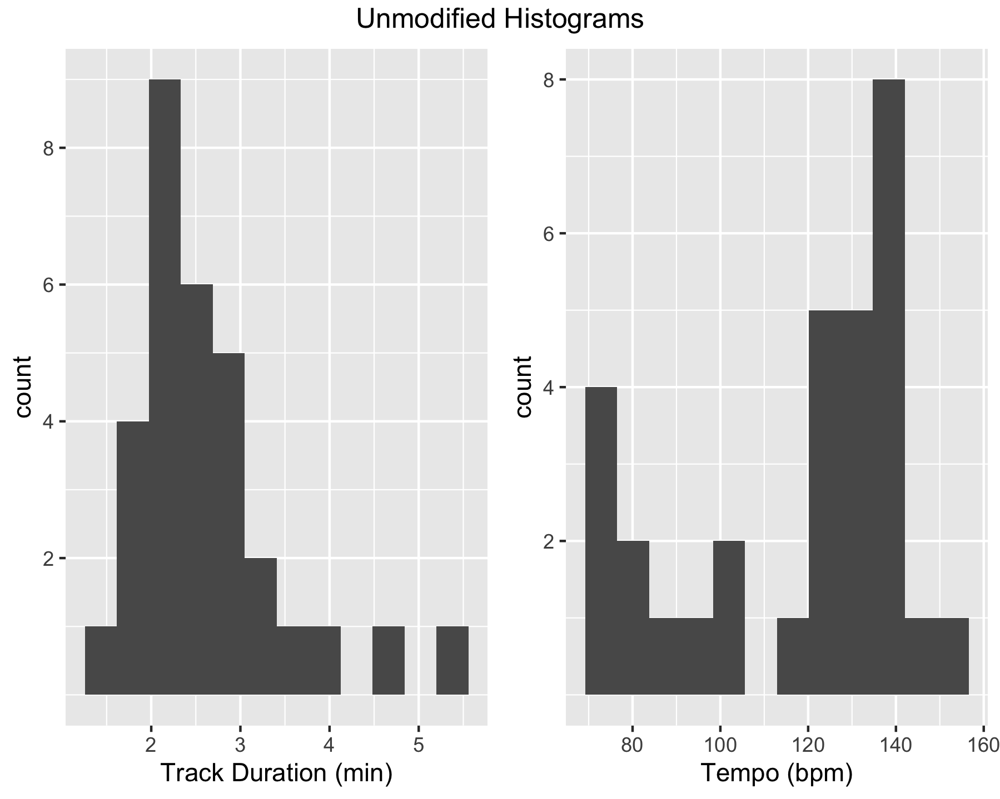
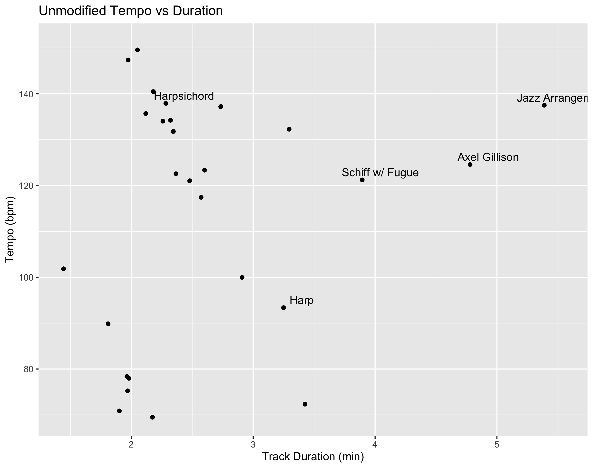
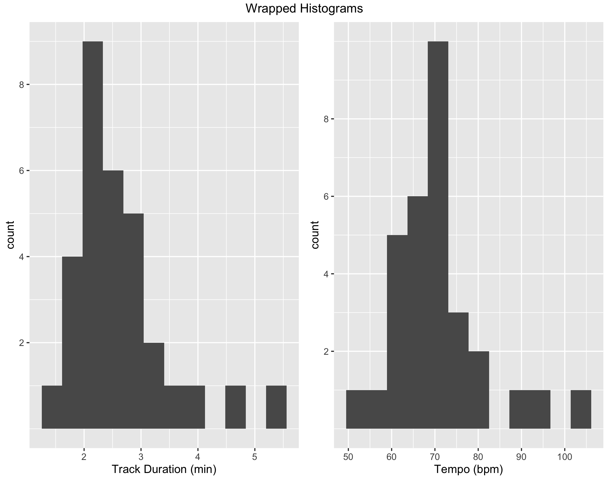
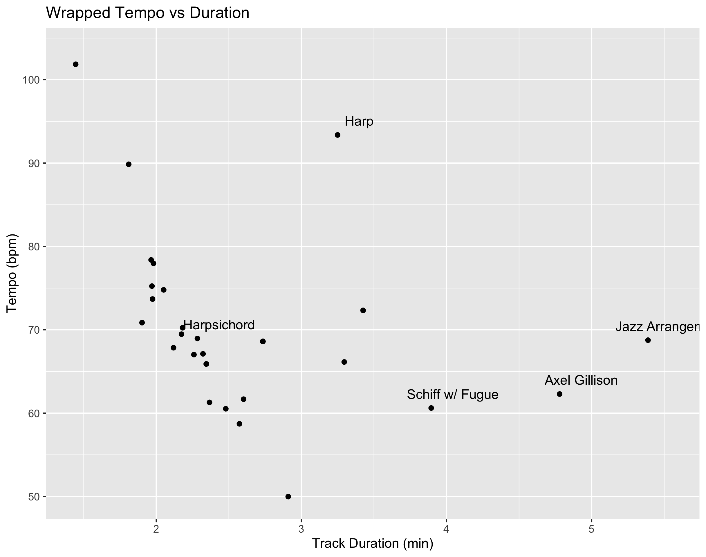
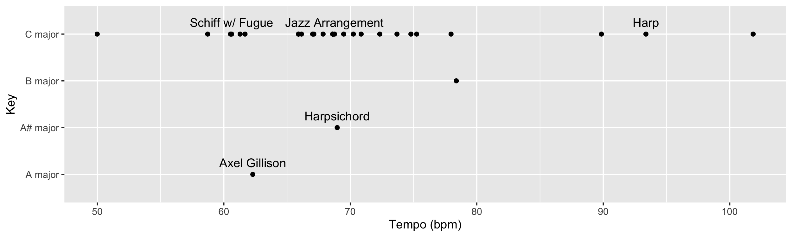

```{r setup, include=FALSE}
knitr::opts_chunk$set(echo = TRUE)
```

# A look at Bach

As a curiosity, I created a playlist containing only tracks of the same piece of music: The C-major prelude (BWV 846) from Bach's Well Tempered Clavier, Book 1.     
<https://open.spotify.com/playlist/4yNYY3xmNhPTDrfFc0qG9b?si=5a035a14f9924ae3>

## About the corpus. 
This playlist contains 29 tracks. 26 of the tracks are of musicians playing exactly the same piece of sheet music (ie: they are trying to play exactly the same notes).  
The exceptions include:  
* The harp recording-labeled "Harp", in which the artist repeated the entire piece, but up an octave.  
* The recording by Sir Andras Schiff which includes the fugue performed after the prelude  
* The Jazz Arrangement by Jacques Loussier, which is labeled "Jazz Arrangement"  

This turned out to be a wonderful introduction to data science, R, the tidyverse, Spotify APIs, and data science in general. I'll walk you through my amusing findings.

Downloading raw track feature extractions from Spotify yielded the following histograms for tempo and duration. 


Given that most of the musicians are playing the exact same piece of music, there are several expectations. First, the track duration should vary inversely and linearly with tempo. There are a fixed number of notes, and when they are played through more quickly, then the track duration should be shorter. But our distributions (using the same number of bins) look different for Track Duration and Tempo. Duration appears gaussian, with three explainable outliers. Tempo however, is a bimodal mess. To confirm my suspsions, I created a scatterplot of tempo vs durations. The two modes are observable: with the first one near the harpsichord label and the second directly below it: near the tempo of 80, duration of 2 minutes mark.
  
A quick survey of the corpus shows that the harp and one other recording (less than 90 seconds duration) are clearly the fastest performances. Using this information, I presume that any tempo faster than the harp (bpm > 95) is actually the eighth-note tempo, if its duration is longer than 90 seconds. So I divide by two to "unwrap" the tempo:
```
  tempo_threshold = 95;
  time_threshold = 1.5;
  bach_prelude_playlist_features = bach_playlist_features %>% 
    mutate(tempo = case_when(tempo>tempo_threshold & track.duration_min > time_threshold ~ tempo * 0.5, TRUE ~ tempo))
```

Re-evaluation shows us a much more convincing distribution for tempo! 

  

## Surprising Outlier: Axel Gillison
Now that the tempo for the tracks is more-or-less calculated correctly and looking proper, the recording labeled Axel Gillison is quite interesting! A listen yields a few interesting observations. Firstly, it is note-per-note a performance of the original piece, except for the fact that it is extraordinarily slow! Also, it's in a lower key!
  
It appears that the creator of this Axel Gillison recording have done a few tricks! First of all, the Axel Gillison "wrapped" tempo is still twice the true tempo! The correct tempo is likely 32bpm. This would put our recording in line with our Tempo vs Duration curve. If we assume that this recording was produced using a sampling rate change (think of slowing down a record player) to change the tempo, we could correct the tempo back to C-major. The frequency ratio between C and A is 19:16-[a minor third](https://en.wikipedia.org/wiki/Minor_third). If we change the sampling rate by this ratio, we would end up with a tempo of 38bpm. This is still roughly half of our median tempo of 68bpm. So, it would appear that some other kind of fancy resampling has been done to yield such a slow tempo.